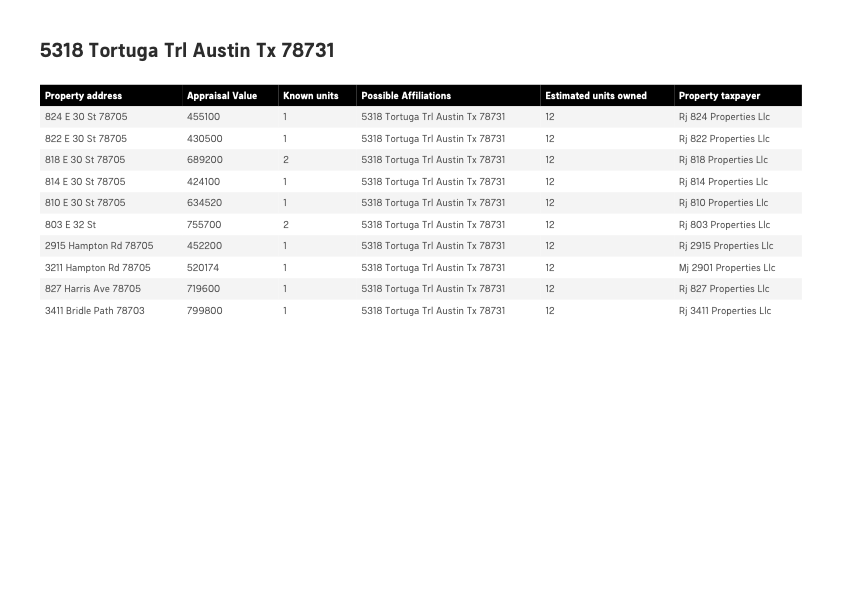

--- 
layout: post
title: "Find My Landlord" 
category: education
author: Chris Correll
--- 

 
  
  

 
  
  

  
  

 
<a href="https://www.accessiblestem.org/find-my-landlord-atx/"><b><i>Find My Landlord</i></b></a>, 2021
  
DSA and BASTA (Texas Rio Grande Legal Aid)
  
Python, Javascript, AI Supervised Learning Model
 

 
 

| component        | link           | free?  |
| ------------- |:-------------:| -----: | 
|  backend   |  [Github](https://github.com/funkonaut/data_pipeline_fmll)      |  TRUE  |
|   frontend    |  [Github](https://github.com/funkonaut/find-my-landlord-atx)      |  TRUE  |

